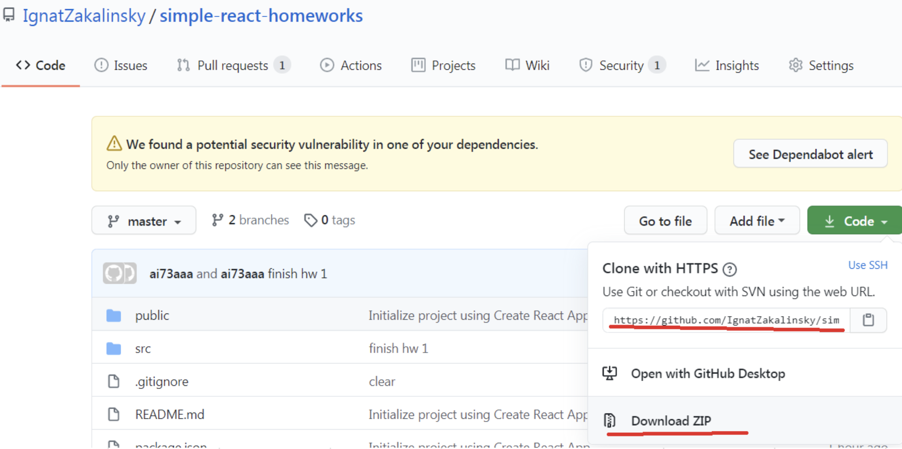
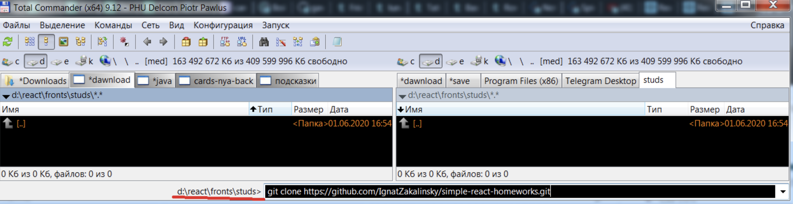
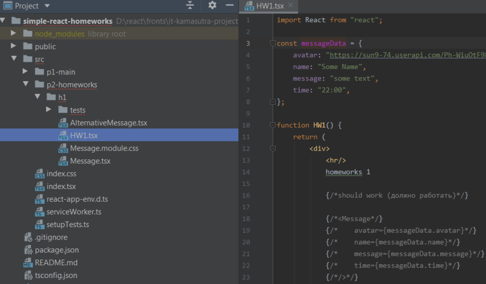

# Проект It-incubator

## Задания от Игната

- Ссылка на репозиторий
  GitHub [react-tsx-ignat-homework](https://stanislav-vasilevich.github.io/ignat-homework-react-tsx/).

- Ссылка на google таблицу с
  заданием [simple react homeworks](https://docs.google.com/spreadsheets/d/18JlsfTElTvbNpmwvhSeiKztqZmF5bRAesmfmrl3P9rM/edit#gid=0)
  .

### Команды для работы

1. забрать изменения из удаленного репозитория и интегрировать их с изменениями в локальном репозитории:

    ```text
      git pull
    ```

2. запуск(локально) в браузере:

    ```text
      yarn start
    ```

3. создать папку build для deploy на сервер:

    ```text
      npm run build
    ```

4. deploy на сервер:

    ```text
      gh-pages -d build
    ```

# Задания

<details>
<summary>Подробнее ...</summary>

# 1-е задание

1. качаем проект домашек [на GitHub](https://github.com/IgnatZakalinsky/simple-react-homeworks)
   
2. распаковываем в папку без русских букв, пробелов и т.д.
   [на GitHub](https://github.com/IgnatZakalinsky/simple-react-homeworks)
   
3. создаём свой проект с тс и копируем в него папку src моего проекта в свой с заменой
   ```text
    yarn create react-app homeworks --template typescript
   ```
4. открываем проект через вэбшторм, прописываем в терминале проекта npm install (или yarn) и ищем компоненту HW1
   [на GitHub](https://github.com/IgnatZakalinsky/simple-react-homeworks)
   
5. нужно сделать так чтоб при раскомментировании Message всё работало и выглядело примерно так:
   [на GitHub](https://github.com/IgnatZakalinsky/simple-react-homeworks)
   
6. нужно типизировать пропсы сразу, any/object/Function - крайне нежелательны даже вначале, если не знаете как - пишем другу, в группу с пометкой #help, мне или на хэлп
7. Ctrl + Alt + L не забывайте нажимать чтоб красивый код был (это увеличивает скорость обучения и чтения кода и облегчает поиск ошибок и понимание "что тут происходит")
8. можете проверить свою работу тестом, кликнув по файлу теста правой кнопкой и выбрав Run 'Message.test.tsx'
9. (не обязательно) компонента AlternativeMessage для личного творчества (можете попробовать другие пропсы и т.д., можно попросить сделать кодревью на хэлпе)
   [на GitHub](https://github.com/IgnatZakalinsky/simple-react-homeworks)
   

</details>

---
---
---

