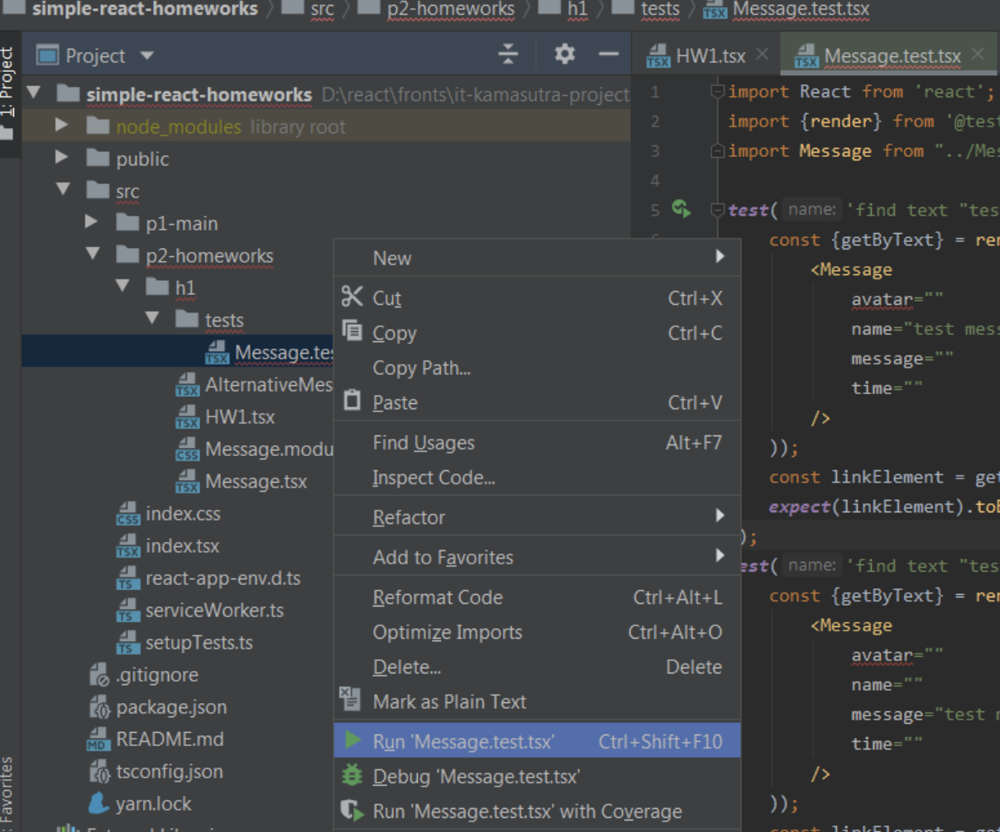
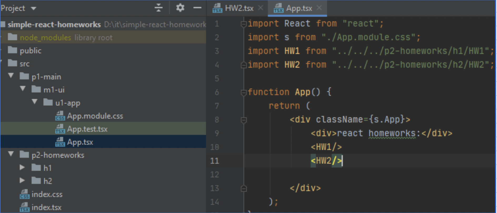
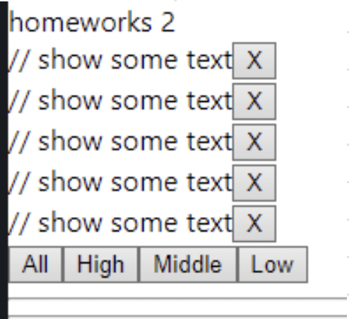
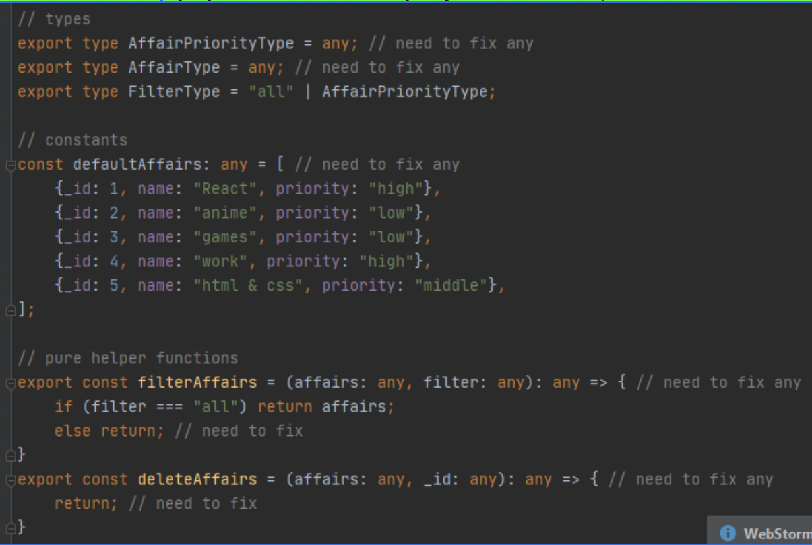
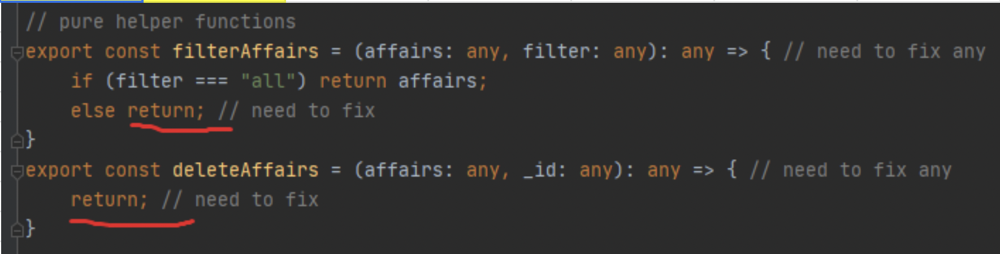
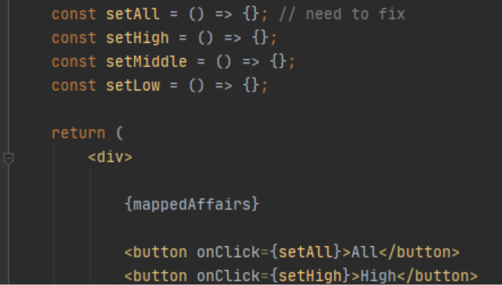
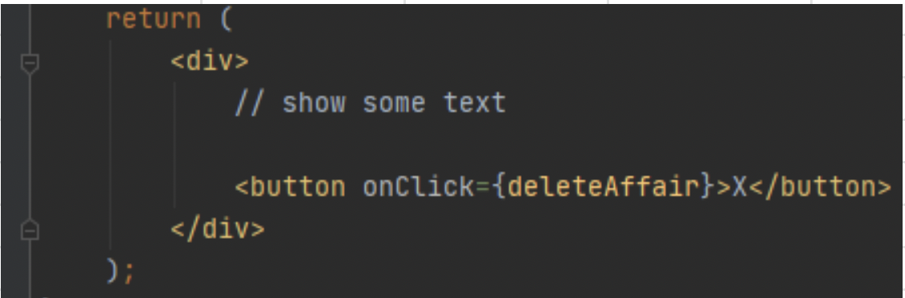
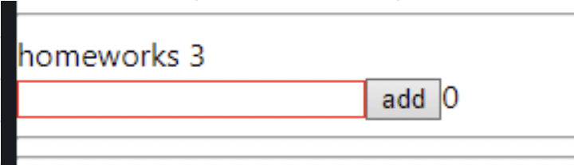
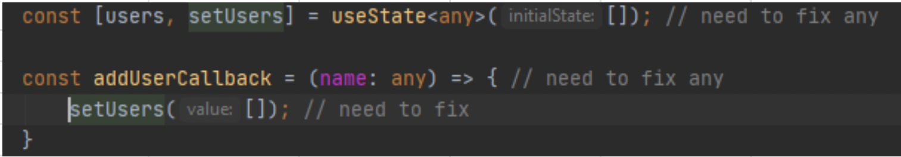
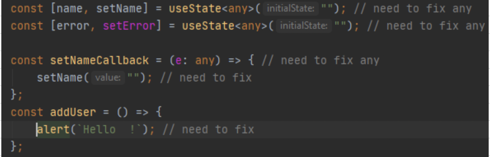

   # Проект It-incubator

## Задания от Игната

- Ссылка на репозиторий
  GitHub [react-tsx-ignat-homework](https://github.com/Stanislav-Vasilevich/ignat-homework).

- Ссылка на веб-приложение
  [перейти..](https://stanislav-vasilevich.github.io/ignat-homework/).

- Ссылка на google таблицу с
  заданием [simple react homeworks](https://docs.google.com/spreadsheets/d/18JlsfTElTvbNpmwvhSeiKztqZmF5bRAesmfmrl3P9rM/edit#gid=0)
  .

### Команды для работы

1. забрать изменения из удаленного репозитория и интегрировать их с изменениями в локальном репозитории:

    ```text
      git pull
    ```

2. запуск(локально) в браузере:

    ```text
      yarn start
    ```

3. создать папку build для deploy на сервер:

    ```text
      npm run build
    ```

4. deploy на сервер:

    ```text
      gh-pages -d build
    ```

# Задания

### 1-е задание

<details>
<summary>Подробнее ...</summary>


1. качаем проект домашек [на GitHub](https://github.com/IgnatZakalinsky/simple-react-homeworks)
   
2. распаковываем в папку без русских букв, пробелов и т.д.
   [на GitHub](https://github.com/IgnatZakalinsky/simple-react-homeworks)
   
3. создаём свой проект с тс и копируем в него папку src моего проекта в свой с заменой
   ```text
    yarn create react-app homeworks --template typescript
   ```
4. открываем проект через вэбшторм, прописываем в терминале проекта npm install (или yarn) и ищем компоненту HW1
   [на GitHub](https://github.com/IgnatZakalinsky/simple-react-homeworks)
   
5. нужно сделать так чтоб при раскомментировании Message всё работало и выглядело примерно так:
   [на GitHub](https://github.com/IgnatZakalinsky/simple-react-homeworks)
   
6. нужно типизировать пропсы сразу, any/object/Function - крайне нежелательны даже вначале, если не знаете как - пишем другу, в группу с пометкой #help, мне или на хэлп
7. Ctrl + Alt + L не забывайте нажимать чтоб красивый код был (это увеличивает скорость обучения и чтения кода и облегчает поиск ошибок и понимание "что тут происходит")
8. можете проверить свою работу тестом, кликнув по файлу теста правой кнопкой и выбрав Run 'Message.test.tsx'
9. (не обязательно) компонента AlternativeMessage для личного творчества (можете попробовать другие пропсы и т.д., можно попросить сделать кодревью на хэлпе)
   [на GitHub](https://github.com/IgnatZakalinsky/simple-react-homeworks)
   

</details>

---
---
---

### 2-е задание

<details>
<summary>Подробнее ...</summary>


1. подключите в App HW2 (изначально будет отключён) [на GitHub](https://github.com/IgnatZakalinsky/simple-react-homeworks)
   
2. в этой домашке есть список дел - нужно чтоб сайт умел сортировать дела по приоритетам и удалять дела
   [на GitHub](https://github.com/IgnatZakalinsky/simple-react-homeworks)
   
3. замените ВСЕ any нужными типами, any/object/Function - крайне нежелательны
   [на GitHub](https://github.com/IgnatZakalinsky/simple-react-homeworks)
   
4. сделайте функции фильтрации и удаления дел так чтоб они прошли тесты
   [на GitHub](https://github.com/IgnatZakalinsky/simple-react-homeworks)
   
5. сделайте колбэки для кнопок в компонентах Affairs и Affair
   [на GitHub](https://github.com/IgnatZakalinsky/simple-react-homeworks)
   
6. отобразите красиво данные "дела" и их приоритет в компоненте Affair [на GitHub](https://github.com/IgnatZakalinsky/simple-react-homeworks)
   
7. Ctrl + Alt + L не забывайте нажимать чтоб красивый код был (это увеличивает скорость обучения и чтения кода и облегчает поиск ошибок и понимание "что тут происходит")
8. (не обязательно) компонента AlternativeAffairs для личного творчества (можете попробовать другие пропсы и т.д., могу по ней сделать кодревью)

</details>

---
---
---

### 3-е задание

<details>
<summary>Подробнее ...</summary>


1. подключите в App HW3 (изначально будет отключён)
2. в этой домашке есть инпут, кнопка и спан - нужно чтоб сайт здоровался с каждым введённым именем, добавлял их в массив и показывал количетво имён
   [на GitHub](https://github.com/IgnatZakalinsky/simple-react-homeworks)
   
3. замените ВСЕ any нужными типами, any/object/Function - крайне нежелательны
   [на GitHub](https://github.com/IgnatZakalinsky/simple-react-homeworks)
   
4. установить библиотеки uuid и @types/uuid и сделать функцию добавления объекта с именем
   [на GitHub](https://github.com/IgnatZakalinsky/simple-react-homeworks)
   
5. добавляйте и приветствуйте только тех у кого НЕ пустое имя, иначе показывайте ошибку
   [на GitHub](https://github.com/IgnatZakalinsky/simple-react-homeworks)
   
6. получите количество юзеров в переменную totalUsers (БЕЗ useState)
7. определите класс инпута с помощью тернарного оператора в зависимости от наличия ошибки, ...и сделайте пж красивую вёрстку :)
8. Ctrl + Alt + L не забывайте нажимать чтоб красивый код был (это увеличивает скорость обучения и чтения кода и облегчает поиск ошибок и понимание "что тут происходит")

</details>

---
---
---
<<<<<<< HEAD

### 4-е задание

<details>
<summary>Подробнее ...</summary>


1. подключите в App HW4 (изначально будет отключён)
2. в этой дз мы сделаем свои навароченные инпут-текст, кнопку и чекбокс что бы их использовать ВМЕСТО стандартных
   [на GitHub](https://github.com/IgnatZakalinsky/simple-react-homeworks)
   
3. замените ВСЕ any нужными типами, any/object/Function - крайне нежелательны
   [на GitHub](https://github.com/IgnatZakalinsky/simple-react-homeworks)
   
4. установить библиотеки uuid и @types/uuid и сделать функцию добавления объекта с именем
   [на GitHub](https://github.com/IgnatZakalinsky/simple-react-homeworks)
   
5. добавляйте и приветствуйте только тех у кого НЕ пустое имя, иначе показывайте ошибку
   [на GitHub](https://github.com/IgnatZakalinsky/simple-react-homeworks)
   
6. получите количество юзеров в переменную totalUsers (БЕЗ useState)
7. определите класс инпута с помощью тернарного оператора в зависимости от наличия ошибки, ...и сделайте пж красивую вёрстку :)
8. Ctrl + Alt + L не забывайте нажимать чтоб красивый код был (это увеличивает скорость обучения и чтения кода и облегчает поиск ошибок и понимание "что тут происходит")

</details>

---
---
---
=======
>>>>>>> 2fd31f60bc06f960b38cc4975766d5ed5abc6193
